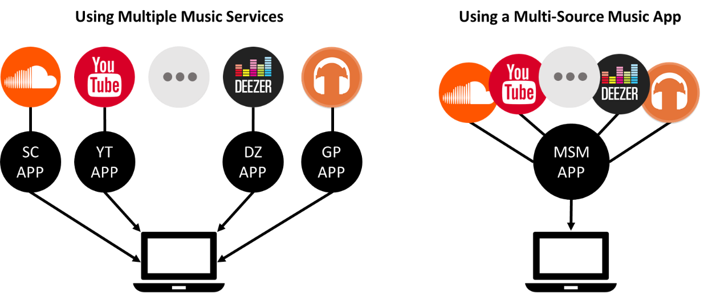
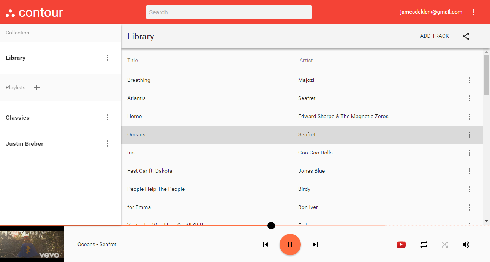
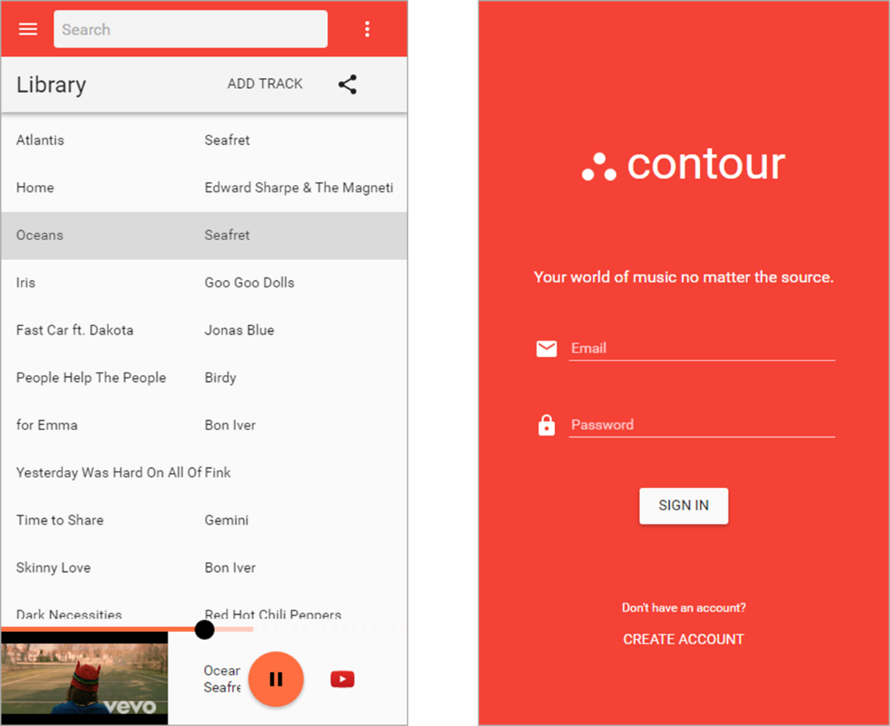
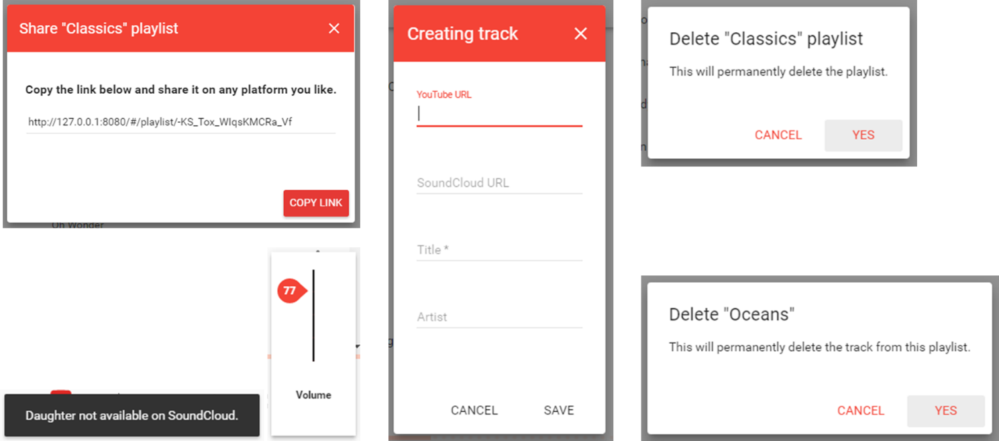

# A Multi-Source Music Application

### NB – Issues one may experience: 
Unfortunately, due to recent restrictions placed on many YouTube music videos, many videos won’t play (the YouTube API restricts playback on certain sites); the “not available on …” error notification will appear, and the app will move on to the next song in the playlist.  
*To test the app, look for Indie music which is less likely to have these restrictions.*

Live demo: https://jamesdeklerk.github.io/multi-source-music-application/ 

## Project Overview

People tend to use a mixture of music services to share, manage and listen to music. The problem is, the experience of sharing, managing and listening to music from multiple music services is cumbersome. The goal of this project was to develop an easily extensible multi-source music application with improved usability relative to existing multi-source music systems.

  

## Tablet and desktop view of a playlist

  

## Mobile view of a playlist (left) and the sign in screen (right)

  

## UI components

  